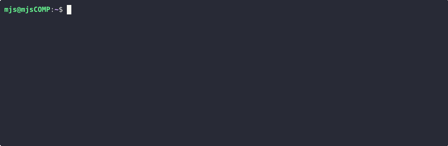
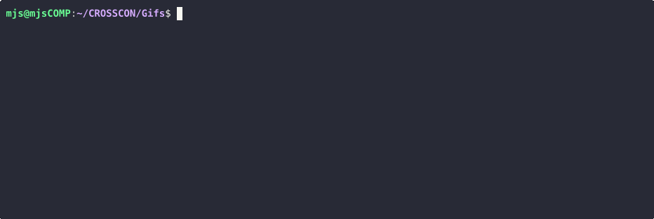
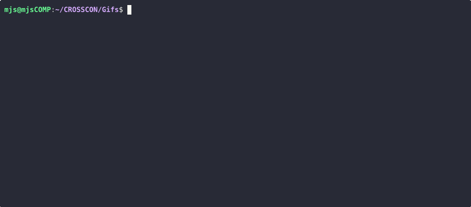
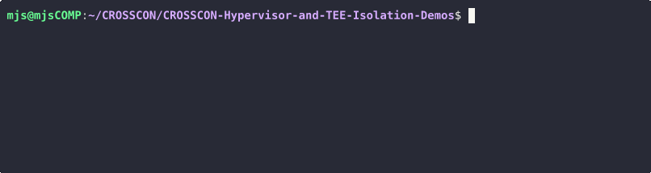
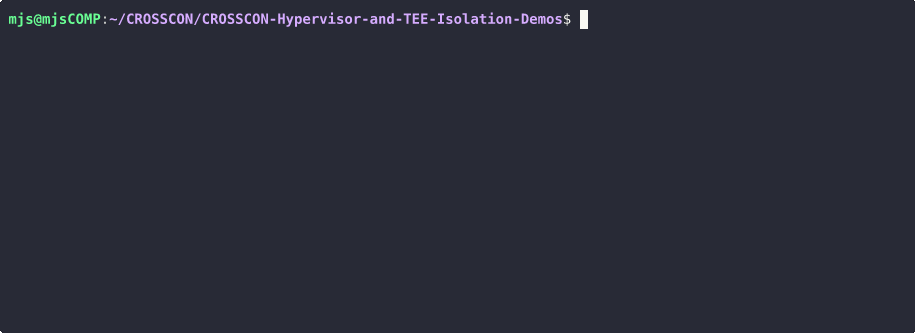
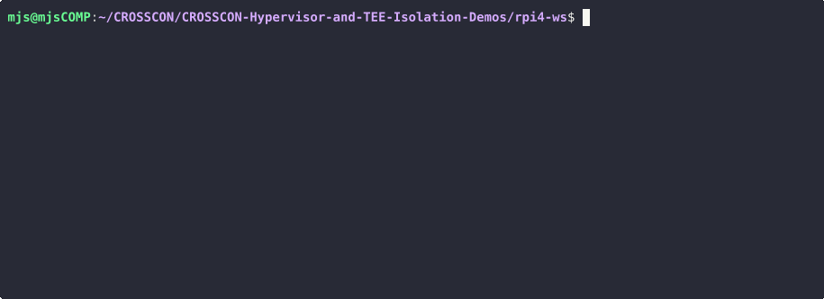

# RPi4 CROSSCON Hypervisor Demo

This guide provides steps to leverage the CROSSCON Hypervisor on the RPi4 to
build virtual TEEs.
Start by setting the root folder path:

```sh
export ROOT=`realpath .`
```

# Setup firmware components

Some fimware components need to downloaded and built. Follow these steps:

```sh
export ROOT=`pwd`
```

```sh
cd rpi4-ws
export RPI4_WS=`pwd`

mkdir bin

git clone https://github.com/raspberrypi/firmware.git --depth 1 --branch 1.20230405

git clone https://github.com/u-boot/u-boot.git --depth 1 --branch v2022.10
cd u-boot
make rpi_4_defconfig
make -j`nproc`  CROSS_COMPILE=aarch64-none-elf-
cp -v u-boot.bin ../bin/
cd $RPI4_WS

git clone https://github.com/bao-project/arm-trusted-firmware.git --branch bao/demo --depth 1
cd arm-trusted-firmware
make PLAT=rpi4 -j`nproc`  CROSS_COMPILE=aarch64-none-elf-
cp -v build/rpi4/release/bl31.bin ../bin/
cd $RPI4_WS
```

---
## Prepare SDCard

In this example the sdcard is `/dev/sdb` and the partitions are `/dev/sdb1`, `/dev/sdb2`, etc.

### i) Start by checking which SD card you have  
```sh
lsblk -o NAME,RM,SIZE,MODEL | grep 1
```


### ii) Make sure all partitions are unmounted

```sh
umount /dev/<your SD card>*
```

### iii) Delete all partitions

```sh
sudo fdisk /dev/<your SD card>
```
Then run the commands:

* Press `d` until there are no more partitions (if it asks you for the partition, press `return` for the default)
* Press `w` write changes and exit



### iv) Create partition

```sh
sudo fdisk /dev/<your SD card>
```

Then run the commands:

* `o` to create a new empty DOS partition table
* `n` to create a new partition. Select the following options:
    *  `p` to make it a primary partition
    *  the automatically assigned partition number by pressing `return`
    *  `16384` (this gap is needed for some of the selected boards)
    *  the max default size by pressing `return`
    *  if it asks you to remove the file system signature press `y`
* `a` to make the partition bootable
* `t` to set the partition type:
    * type `c` for W95 FAT32 (LBA)
* `w` to write changes and exit


### v) Format partition
Format the created partition to a fat filesystem:
```sh
sudo mkfs.fat /dev/<your SD card>1 -n boot
```

Remove and insert the sd card to automatically mount it. 


---
# Copy Firmware Files to SDCard
 copy the firmware and CROSSCON Hypervisor's final image to it:

```sh
cd $RPI4_WS
SDCARD=/media/$USER/boot

cp -vr firmware/boot/* $SDCARD
cp -v config.txt $SDCARD
cp -v bin/bl31.bin $SDCARD
cp -v bin/u-boot.bin $SDCARD
```


---
# Build Components

```sh
cd $ROOT
```

## Step 1: OP-TEE OS
```sh
cd optee_os

OPTEE_DIR="./"
export O="$OPTEE_DIR/optee-rpi4"
CC="aarch64-none-elf-"
export CFLAGS=-Wno-cast-function-type
PLATFORM="rpi4"
ARCH="arm"
SHMEM_START="0x08000000"
SHMEM_SIZE="0x00200000"
TZDRAM_START="0x10100000"
TZDRAM_SIZE="0x00F00000"
CFG_GIC=n

rm -rf $O

make -C $OPTEE_DIR \
    O=$O \
    CROSS_COMPILE=$CC \
    PLATFORM=$PLATFORM \
    PLATFORM_FLAVOR=$PLATFORM_FLAVOR \
    ARCH=$ARCH \
    CFG_PKCS11_TA=n \
    CFG_SHMEM_START=$SHMEM_START \
    CFG_SHMEM_SIZE=$SHMEM_SIZE \
    CFG_CORE_DYN_SHM=n \
    CFG_NUM_THREADS=1 \
    CFG_CORE_RESERVED_SHM=y \
    CFG_CORE_ASYNC_NOTIF=n \
    CFG_TZDRAM_SIZE=$TZDRAM_SIZE \
    CFG_TZDRAM_START=$TZDRAM_START \
    CFG_GIC=y \
    CFG_ARM_GICV2=y \
    CFG_CORE_IRQ_IS_NATIVE_INTR=n \
    CFG_ARM64_core=y \
    CFG_USER_TA_TARGETS=ta_arm64 \
    CFG_DT=n \
    CFG_CORE_ASLR=n \
    CFG_CORE_WORKAROUND_SPECTRE_BP=n \
    CFG_CORE_WORKAROUND_NSITR_CACHE_PRIME=n \
    CFG_TEE_CORE_LOG_LEVEL=1 \
    DEBUG=1 -j16


OPTEE_DIR="./"
export O="$OPTEE_DIR/optee2-rpi4"
SHMEM_START="0x08200000"
TZDRAM_START="0x20100000"

rm -rf $O

make -C $OPTEE_DIR \
    O=$O \
    CROSS_COMPILE=$CC \
    PLATFORM=$PLATFORM \
    PLATFORM_FLAVOR=$PLATFORM_FLAVOR \
    ARCH=$ARCH \
    CFG_PKCS11_TA=n \
    CFG_SHMEM_START=$SHMEM_START \
    CFG_SHMEM_SIZE=$SHMEM_SIZE \
    CFG_CORE_DYN_SHM=n \
    CFG_CORE_RESERVED_SHM=y \
    CFG_CORE_ASYNC_NOTIF=n \
    CFG_TZDRAM_SIZE=$TZDRAM_SIZE \
    CFG_TZDRAM_START=$TZDRAM_START \
    CFG_GIC=y \
    CFG_ARM_GICV2=y \
    CFG_CORE_IRQ_IS_NATIVE_INTR=n \
    CFG_ARM64_core=y \
    CFG_USER_TA_TARGETS=ta_arm64 \
    CFG_DT=n \
    CFG_CORE_ASLR=n \
    CFG_CORE_WORKAROUND_SPECTRE_BP=n \
    CFG_CORE_WORKAROUND_NSITR_CACHE_PRIME=n \
    CFLAGS="${CFLAGS} -DOPTEE2" \
    CFG_EARLY_TA=y \
    CFG_TEE_CORE_LOG_LEVEL=1 \
    DEBUG=1 -j16

cd $ROOT
```


## Step 2: Linux file system
We will first build an incomplete filesystem to benefit fom buildroot building the appropriate linux toolchains.
We've tested with Buildroot 2022.11.1 (https://buildroot.org/downloads/buildroot-2022.11.1.tar.gz)
``` sh
if [ ! -e buildroot ]; then
	wget https://buildroot.org/downloads/buildroot-2022.11.1.tar.gz
	tar -xf buildroot-2022.11.1.tar.gz
	mv buildroot-2022.11.1 buildroot
fi
```

Create build directory:
``` sh
mkdir buildroot/build-aarch64
```

Set our predefined `.config` files:
``` sh
cp support/br-aarch64.config buildroot/build-aarch64/.config
```

This build step will fail as we haven't yet setup all the binaries necessary for the full filesystem. However, we take advantage of the fact that buildroot builds the linux toolchain to build these missing binaries. Build:
``` sh
cd buildroot

make O=build-aarch64/ -j`nproc`

cd $ROOT
```


## Step 3: Build OP-TEE Clients
Build the optee client application library and tee supplicant for both OP-TEEs.
``` sh
cd optee_client

git checkout master
make CROSS_COMPILE=aarch64-none-linux-gnu- WITH_TEEACL=0 O=out-aarch64
git checkout optee2
make CROSS_COMPILE=aarch64-none-linux-gnu- WITH_TEEACL=0 O=out2-aarch64

cd $ROOT
```

## Step 4: Build OP-TEE xtest
Build the OP-TEE xtest test suite.
``` sh
cd optee_test

BUILDROOT=`pwd`/../buildroot/build-aarch64/
export CROSS_COMPILE=$BUILDROOT/host/bin/aarch64-linux-
export HOST_CROSS_COMPILE=$BUILDROOT/host/bin/aarch64-linux-
export TA_CROSS_COMPILE=$BUILDROOT/host/bin/aarch64-linux-
export ARCH=aarch64
export PLATFORM=plat-vexpress
export PLATFORM_FLAVOR=qemu_armv8a
export TA_DEV_KIT_DIR=`pwd`/../optee_os/optee-rpi4/export-ta_arm64
export TEEC_EXPORT=`pwd`/../optee_client/out-aarch64/export/usr/
export OPTEE_CLIENT_EXPORT=`pwd`/../optee_client/out-aarch64/export/usr/
export CFG_TA_OPTEE_CORE_API_COMPAT_1_1=y
export DESTDIR=./to_buildroot-aarch64
export DEBUG=0
export CFG_TEE_TA_LOG_LEVEL=0
export CFLAGS=-O2
export O=`pwd`/out-aarch64
export CFG_PKCS11_TA=n

rm -rf $O
rm -rf to_buildroot-aarch64/
find . -name "Makefile" -exec sed -i "s/\-lteec2$/\-lteec/g" {} +
find . -name "Makefile" -exec sed -i "s/optee2_armtz/optee_armtz/g" {} +
make clean
make -j`nproc`
make install


export O=`pwd`/out2-aarch64
export DESTDIR=./to_buildroot-aarch64-2
export TA_DEV_KIT_DIR=`pwd`/../optee_os/optee2-rpi4/export-ta_arm64
export TEEC_EXPORT=`pwd`/../optee_client/out2-aarch64/export/usr/
export OPTEE_CLIENT_EXPORT=`pwd`/../optee_client/out2-aarch64/export/usr/
rm -rf `pwd`/out2-aarch64
find . -name "Makefile" -exec sed -i "s/\-lteec$/\-lteec2/g" {} +
find . -name "Makefile" -exec sed -i "s/optee_armtz/optee2_armtz/g" {} +
make clean
make -j`nproc`
make install
find . -name "Makefile" -exec sed -i "s/\-lteec2$/\-lteec/g" {} +
find . -name "Makefile" -exec sed -i "s/optee2_armtz/optee_armtz/g" {} +

mv $DESTDIR/bin/xtest $DESTDIR/bin/xtest2
cd $ROOT
```


## Step 5: Compile Bitcoin Wallet Client and Trusted Application
```sh
cd bitcoin-wallet

BUILDROOT=`pwd`/../buildroot/build-aarch64/

export CROSS_COMPILE=$BUILDROOT/host/bin/aarch64-linux-
export HOST_CROSS_COMPILE=$BUILDROOT/host/bin/aarch64-linux-
export TA_CROSS_COMPILE=$BUILDROOT/host/bin/aarch64-linux-
export ARCH=aarch64
export PLATFORM=plat-virt
export TA_DEV_KIT_DIR=`pwd`/../optee_os/optee-rpi4/export-ta_arm64
export TEEC_EXPORT=`pwd`/../optee_client/out-aarch64/export/usr/
export OPTEE_CLIENT_EXPORT=`pwd`/../optee_client/out-aarch64/export/usr/
export CFG_TA_OPTEE_CORE_API_COMPAT_1_1=n
export DESTDIR=./to_buildroot-aarch64
export DEBUG=0
export CFG_TEE_TA_LOG_LEVEL=0
export O=`pwd`/out-aarch64

rm -rf out-aarch64/
## make sure we have things setup for first OP-TEE
find . -name "Makefile" -exec sed -i "s/\-lteec2$/\-lteec/g" {} +
find . -name "Makefile" -exec sed -i "s/optee2_armtz/optee_armtz/g" {} +
make clean
make -j`nproc`

mkdir -p to_buildroot-aarch64/lib/optee_armtz
mkdir -p to_buildroot-aarch64/bin

cp out-aarch64/*.ta to_buildroot-aarch64/lib/optee_armtz
cp host/wallet to_buildroot-aarch64/bin/bitcoin_wallet_ca
chmod +x to_buildroot-aarch64/bin/bitcoin_wallet_ca

## setup second OP-TEE
export O=`pwd`/out2-aarch64
export DESTDIR=./to_buildroot-aarch64-2
export TA_DEV_KIT_DIR=`pwd`/../optee_os/optee2-rpi4/export-ta_arm64
export TEEC_EXPORT=`pwd`/../optee_client/out2-aarch64/export/usr/
export OPTEE_CLIENT_EXPORT=`pwd`/../optee_client/out2-aarch64/export/usr/
rm -rf `pwd`/out2-aarch64
find . -name "Makefile" -exec sed -i "s/\-lteec/\-lteec2/g" {} +
find . -name "Makefile" -exec sed -i "s/optee_armtz/optee2_armtz/g" {} +
make clean
make -j`nproc`
## undo changes
find . -name "Makefile" -exec sed -i "s/\-lteec2/\-lteec/g" {} +
find . -name "Makefile" -exec sed -i "s/optee2_armtz/optee_armtz/g" {} +

mkdir -p to_buildroot-aarch64-2/lib/optee2_armtz
mkdir -p to_buildroot-aarch64-2/bin

cp out-aarch64/*.ta to_buildroot-aarch64-2/lib/optee2_armtz
cp host/wallet to_buildroot-aarch64-2/bin/bitcoin_wallet_ca2
chmod +x to_buildroot-aarch64-2/bin/bitcoin_wallet_ca2


cd $ROOT
```


## Step 6: Compile Malicious Client and Trusted Application
```
cd malicous_ta
BUILDROOT=`pwd`/../buildroot/build-aarch64/
export CROSS_COMPILE=$BUILDROOT/host/bin/aarch64-linux-
export HOST_CROSS_COMPILE=$BUILDROOT/host/bin/aarch64-linux-
export TA_CROSS_COMPILE=$BUILDROOT/host/bin/aarch64-linux-
export ARCH=aarch64
export PLATFORM=plat-virt
export TA_DEV_KIT_DIR=`pwd`/../optee_os/optee-rpi4/export-ta_arm64
export TEEC_EXPORT=`pwd`/../optee_client/out-aarch64/export/usr/
export OPTEE_CLIENT_EXPORT=`pwd`/../optee_client/out-aarch64/export/usr/
export CFG_TA_OPTEE_CORE_API_COMPAT_1_1=n
export DESTDIR=./to_buildroot-aarch64
export DEBUG=0
export CFG_TEE_TA_LOG_LEVEL=2
export O=`pwd`/out-aarch64
export aarch64_TARGET=y 
rm -rf out-aarch64/
## make sure we have things setup for first OP-TEE
find . -name "Makefile" -exec sed -i "s/\-lteec2$/\-lteec/g" {} +
find . -name "Makefile" -exec sed -i "s/optee2_armtz/optee_armtz/g" {} +
make clean
make -j`nproc`
mkdir -p to_buildroot-aarch64/lib/optee_armtz
mkdir -p to_buildroot-aarch64/bin
cp out-aarch64/*.ta to_buildroot-aarch64/lib/optee_armtz
cp host/malicious_ca to_buildroot-aarch64/bin/malicious_ca
chmod +x to_buildroot-aarch64/bin/malicious_ca
## setup second OP-TEE
export O=`pwd`/out2-aarch64
export DESTDIR=./to_buildroot-aarch64-2
export TA_DEV_KIT_DIR=`pwd`/../optee_os/optee2-rpi4/export-ta_arm64
export TEEC_EXPORT=`pwd`/../optee_client/out2-aarch64/export/usr/
export OPTEE_CLIENT_EXPORT=`pwd`/../optee_client/out2-aarch64/export/usr/
rm -rf `pwd`/out2-aarch64
find . -name "Makefile" -exec sed -i "s/\-lteec/\-lteec2/g" {} +
find . -name "Makefile" -exec sed -i "s/optee_armtz/optee2_armtz/g" {} +
make clean
make -j`nproc`
## undo changes
find . -name "Makefile" -exec sed -i "s/\-lteec2/\-lteec/g" {} +
find . -name "Makefile" -exec sed -i "s/optee2_armtz/optee_armtz/g" {} +
mkdir -p to_buildroot-aarch64-2/lib/optee2_armtz
mkdir -p to_buildroot-aarch64-2/bin
cp out2-aarch64/*.ta to_buildroot-aarch64-2/lib/optee2_armtz
cp host/malicious_ca to_buildroot-aarch64-2/bin/malicious_ca2
chmod +x to_buildroot-aarch64-2/bin/malicious_ca2
cd $ROOT
```


## Step 7: Finalize Linux file system
We have everything setup now, so build the final file system for Linux.
```sh
cd buildroot

make O=build-aarch64/ -j`nproc`

cd $ROOT
```


## Step 8: Build Linux

Set our predefined `.config` files:
``` sh
mkdir linux/build-aarch64/
cp support/linux-aarch64.config linux/build-aarch64/.config

cd linux

make ARCH=arm64 O=build-aarch64 CROSS_COMPILE=`realpath ../buildroot/build-aarch64/host/bin/aarch64-linux-` -j16 Image dtbs

cd $ROOT
```


---
### Step 9: Bind Linux Image and device tree

```sh
dtc -I dts -O dtb rpi4-ws/rpi4.dts > rpi4-ws/rpi4.dtb
```

```sh
cd lloader

rm linux-rpi4.bin
rm linux-rpi4.elf
make  \
    IMAGE=../linux/build-aarch64/arch/arm64/boot/Image \
    DTB=../rpi4-ws/rpi4.dtb \
    TARGET=linux-rpi4.bin \
    CROSS_COMPILE=aarch64-none-elf- \
    ARCH=aarch64

cd $ROOT
```


### Simple Demo
This demo instantiates a Linux VM and an OP-TEE VM. Insert the sdcard in your
pc, and wait for it to mount the boot partition. Otherwise mount the sd card
manually. The script expects `SDCARD` to be set (e.g.,`/media/$USER/boot`)

``` sh
./build-demo-vtee.sh
```


#### Setup board

Insert the sd card in the board's sd slot.

Connect to the Raspberry Pi's UART using a USB-to-TTL adapter to connect to the Raspberry Pi's GPIO header UART pins. 

- VCC (Pin 4 on RPI4) → Connect to VCC on the USB-to-TTL adapter. This provides power to the adapter.
- GND (Pin 6 on RPI4) → Connect to GND on the adapter to establish a common ground.
- TX (Pin 8 on RPI4) → Connect to RX on the adapter. This allows the RPI4 to send data to the adapter’s receive line.
- RX (Pin 10 on RPI4) → Connect to TX on the adapter, enabling data reception from the adapter’s transmit line.

Use a terminal application such as  `miniterm.py` from pyserial package. For example:

```
miniterm.py /dev/ttyUSB0 115200
```

Turn on/reset your board.

#### Run u-boot commands

Quickly press any key to skip autoboot. If not possibly press `ctrl-c` until you get the u-boot prompt. Then load the bao image, and jump to it:

```
fatload mmc 0 0x200000 crossconhyp.bin; go 0x200000
```

You should see bao and its guest printing on the UART.

After Linux finishes booting run xtest as follows:
``` sh
xtest -t regression
```

### Demo 2
This demo instantiates a Linux VM and two OP-TEE VMs.
``` sh
./build-demo-dual-vtee.sh
```

After Linux finishes booting you may execute xtest in both OP-TEE VMs.
``` sh
xtest -t regression
xtest2 -t regression
```

